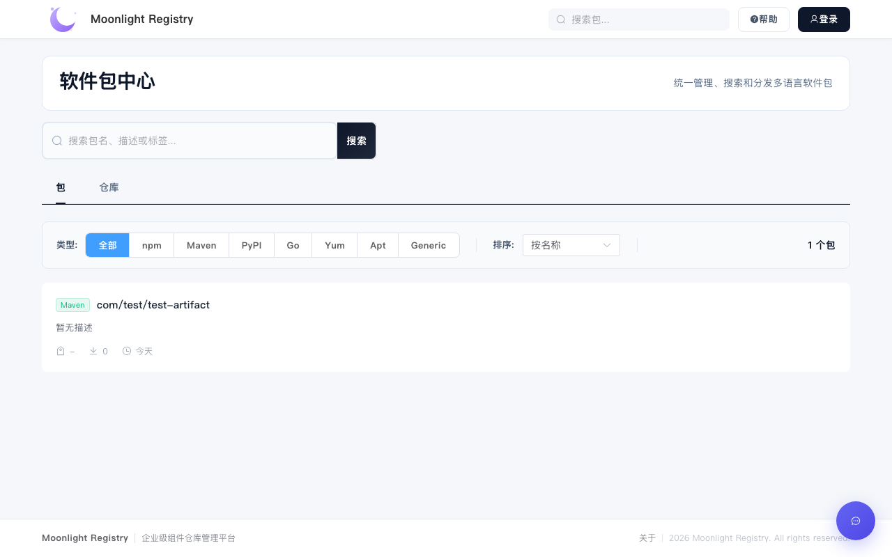
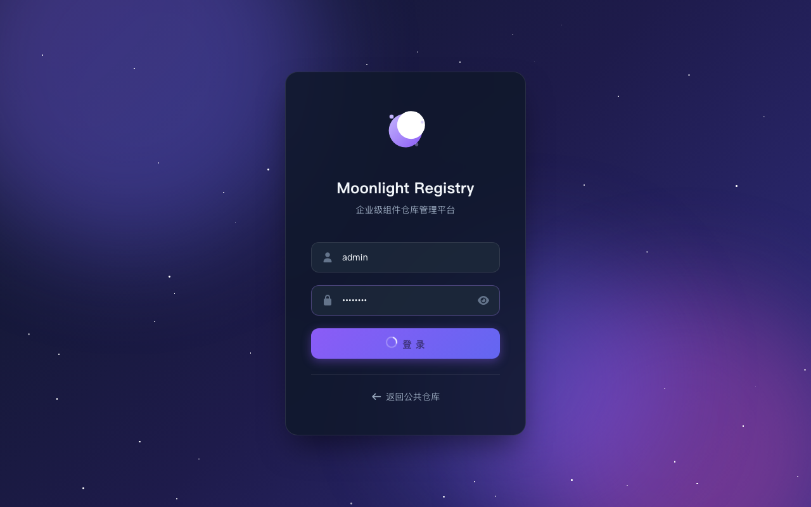

# Moonlight Box

[English](README.en.md) | 简体中文

企业级多协议包仓库管理系统，支持多种包格式的代理、缓存、托管与安全扫描。

<!-- screenshot-start -->

<!-- screenshot-end -->

## 特性

### 核心功能

- **多协议支持：** 内置 npm、Maven、PyPI、Go Modules、YUM、APT、Generic 等主流包仓库适配器
- **智能代理路由：** 支持本地仓库、代理仓库、虚拟仓库的智能路由，自动回源与缓存加速
- **仓库分组：** 支持虚拟仓库组，聚合多个托管仓库，简化客户端配置
- **多存储后端：** 支持本地文件系统与 Amazon S3 对象存储

### 安全合规

- **漏洞扫描：** 包上传自动扫描，支持拦截高危漏洞包
- **访问阻断：** 基于包名、版本、域名等规则的访问控制，有效阻止潜在威胁
- **权限管理：** 基于角色的访问控制（RBAC），支持 CAS 单点登录

### 智能运维

- **AI 智能助手：** 集成大语言模型，支持日志查询、数据库查询、包信息查询、安全分析等工具调用
- **操作审计：** 记录所有操作日志，支持审计追踪，满足企业合规要求
- **可观测性：** Prometheus 指标采集，结构化日志输出

### 数据管理

- **多数据库支持：** SQLite（默认）与 PostgreSQL
- **数据迁移：** 支持从 Nexus Repository Manager 迁移数据
- **配置备份：** 支持系统和仓库配置的备份与恢复

## 界面预览

<!-- screenshots-start -->
| 仪表盘 | 仓库管理 |
|:---:|:---:|
|  |  |

| 包管理 | 关于页面 |
|:---:|:---:|
|  |  |

| 安全中心 | 帮助中心 |
|:---:|:---:|
|  |  |
<!-- screenshots-end -->

## 快速开始

### 环境要求

- Go >= 1.24
- Node.js >= 20（前端构建）
- SQLite 或 PostgreSQL

### 安装

```bash
# 克隆项目
git clone https://github.com/moonlight-box/moonlight-box.git
cd moonlight-box

# 编译
make build

# 或直接运行
make run
```

### 配置

复制示例配置文件并根据实际情况修改：

```bash
cp configs/config.example.yaml configs/config.yaml
```

核心配置项说明：

| 配置项 | 说明 | 默认值 |
|--------|------|--------|
| `server.port` | 服务端口 | 9081 |
| `database.driver` | 数据库驱动（sqlite / postgres） | sqlite |
| `storage.backend` | 存储后端（local / s3） | local |
| `ai.enabled` | 是否启用 AI 助手 | false |
| `cache.enabled` | 是否启用缓存 | true |
| `security.enabled` | 是否启用安全扫描 | true |

### 启动

```bash
# 使用默认配置启动
./bin/moonlight-box

# 指定配置文件
./bin/moonlight-box -config configs/config.yaml

# 查看版本
./bin/moonlight-box -version
```

启动后访问 `http://localhost:9081` 即可使用。

## 架构设计

### 系统架构图

```
┌─────────────────────────────────────────────────────────────────────────────┐
│                              Moonlight Box                                   │
├─────────────────────────────────────────────────────────────────────────────┤
│  ┌─────────────┐  ┌─────────────┐  ┌─────────────┐  ┌─────────────┐        │
│  │   Handler   │  │   Proxy     │  │     AI      │  │   Security  │        │
│  │    Layer    │  │   Router    │  │   Service   │  │   Scanner   │        │
│  └──────┬──────┘  └──────┬──────┘  └──────┬──────┘  └──────┬──────┘        │
│         │                │                │                │               │
│  ┌──────┴────────────────┴────────────────┴────────────────┴──────┐        │
│  │                        Service Layer                            │        │
│  │  ┌──────────┐ ┌──────────┐ ┌──────────┐ ┌──────────┐          │        │
│  │  │  Auth    │ │  Repo    │ │ Storage  │ │ Migration│          │        │
│  │  │ Service  │ │ Service  │ │ Service  │ │ Service  │          │        │
│  │  └────┬─────┘ └────┬─────┘ └────┬─────┘ └────┬─────┘          │        │
│  │       └─────────────┴─────────────┴─────────────┘              │        │
│  └───────────────────────────┬────────────────────────────────────┘        │
│                              │                                              │
│  ┌───────────────────────────┴────────────────────────────────────┐        │
│  │                      Repository Layer                           │        │
│  │  ┌──────────┐ ┌──────────┐ ┌──────────┐ ┌──────────┐          │        │
│  │  │ Package  │ │   Repo   │ │   User   │ │  Audit   │          │        │
│  │  │   Repo   │ │   Repo   │ │   Repo   │ │   Repo   │          │        │
│  │  └──────────┘ └──────────┘ └──────────┘ └──────────┘          │        │
│  └───────────────────────────┬────────────────────────────────────┘        │
│                              │                                              │
│  ┌───────────────────────────┴────────────────────────────────────┐        │
│  │                      Adapter Layer                              │        │
│  │  ┌────────┐ ┌────────┐ ┌────────┐ ┌────────┐ ┌────────┐        │        │
│  │  │  npm   │ │ Maven  │ │ PyPI   │ │  Go    │ │  Yum   │ ...    │        │
│  │  └────────┘ └────────┘ └────────┘ └────────┘ └────────┘        │        │
│  └────────────────────────────────────────────────────────────────┘        │
│                              │                                              │
│  ┌───────────────────────────┴────────────────────────────────────┐        │
│  │                        Data Layer                               │        │
│  │  ┌──────────────────┐              ┌──────────────────┐        │        │
│  │  │ SQLite/PostgreSQL│              │ Local FS / S3    │        │        │
│  │  └──────────────────┘              └──────────────────┘        │        │
│  └────────────────────────────────────────────────────────────────┘        │
└─────────────────────────────────────────────────────────────────────────────┘
```

### 分层架构说明

| 层级 | 职责 | 对应目录 |
|------|------|----------|
| **Presentation** | HTTP 请求处理、路由、参数校验 | `handler/`, `middleware/` |
| **Business Logic** | 业务规则、流程编排 | `service/`, `proxy/` |
| **Data Access** | 数据库操作、事务管理 | `repository/` |
| **Domain** | 领域模型、值对象 | `model/`, `types/` |
| **Infrastructure** | 存储、缓存、外部服务 | `storage/`, `cache/`, `adapter/` |

### 核心设计模式

- **适配器模式**：统一不同包仓库协议差异，支持 npm、Maven、PyPI、Go、YUM、APT、Generic
- **策略模式**：根据仓库类型（Local/Proxy/Virtual）选择不同解析策略
- **工厂模式**：存储后端（Local/S3）动态创建
- **熔断器模式**：远程仓库健康检查与熔断保护
- **模板方法**：BaseAdapter 定义通用流程，子类实现特定逻辑

### 请求处理流程

```
Client Request
      ↓
┌─────────────┐
│   Router    │ → 路由匹配
└──────┬──────┘
       ↓
┌─────────────┐
│   Handler   │ → 参数解析、权限校验
└──────┬──────┘
       ↓
┌─────────────┐
│   Service   │ → 业务逻辑处理
└──────┬──────┘
       ↓
┌─────────────┐
│  Repository │ → 数据持久化
└──────┬──────┘
       ↓
┌─────────────┐
│   Storage   │ → 文件存储
└─────────────┘
```

### 代理路由机制

Proxy Router 负责将包请求智能路由到正确的来源：

1. **本地优先**：优先从本地仓库查找
2. **代理回源**：本地未命中时自动从配置的远程仓库拉取
3. **缓存加速**：拉取结果自动缓存，减少重复请求
4. **健康检查**：定期检测远程仓库可用性，熔断不可用源
5. **虚拟仓库**：支持聚合多个仓库，按优先级遍历

## AI 助手

系统内置 AI 智能助手，支持以下工具：

| 工具 | 说明 |
|------|------|
| `log_query` | 查询系统日志 |
| `db_query` | 执行数据库查询 |
| `package_info` | 查询包信息与依赖关系 |
| `security_analysis` | 安全漏洞分析 |
| `code_generator` | 代码生成 |

配置示例：

```yaml
ai:
  enabled: true
  provider: "openai"  # openai, chatglm, qwen, custom
  base_url: "http://localhost:8000/v1"
  api_key: "your-api-key"
  model: "gpt-4"
```

## 开发指南

### 常用命令

```bash
# 编译
make build

# 运行
make run

# 运行测试
make test

# 生成测试覆盖率报告
make test-coverage

# 代码检查
make lint

# 清理构建产物
make clean

# 开发模式（热重载）
make dev

# 构建前端并嵌入
make embed-web
```

### 项目结构

```
moonlight-box/
├── cmd/registry/          # 主程序入口
│   ├── main.go           # 启动入口
│   ├── router.go         # 路由配置
│   └── frontend.go       # 前端静态文件服务
├── configs/               # 配置文件
├── internal/              # 核心业务代码
│   ├── adapter/           # 包类型适配器（npm/maven/pypi等）
│   ├── ai/                # AI 功能模块
│   ├── cache/             # 缓存系统
│   ├── config/            # 配置管理
│   ├── constants/         # 常量定义
│   ├── database/          # 数据库连接
│   ├── errors/            # 错误定义
│   ├── handler/           # HTTP 处理器
│   ├── middleware/        # Gin 中间件
│   ├── migration/         # 数据迁移
│   ├── model/             # 数据模型（GORM）
│   ├── proxy/             # 代理下载逻辑
│   ├── repository/        # 数据访问层
│   ├── response/          # 统一响应封装
│   ├── service/           # 业务逻辑层
│   ├── storage/           # 存储后端抽象
│   ├── types/             # 类型定义/接口
│   ├── util/              # 工具函数
│   └── version/           # 版本解析
├── web/                   # 前端项目（Vue 3 + TypeScript）
├── docs/                  # 文档
├── scripts/               # 脚本
└── Makefile
```

### 添加新的包适配器

实现 `types.Adapter` 接口即可添加新的包类型支持：

```go
type Adapter interface {
    Type() types.PackageType
    ParseIntent(path string, method string) *types.RequestIntent
    HandleGet(ctx context.Context, repo *model.Repository, intent *types.RequestIntent) (*types.ContentResult, error)
    HandlePut(c *gin.Context, ctx *types.PublishContext) (*types.PublishResult, error)
    HandleDelete(c *gin.Context, ctx *types.DeleteContext) error
    ParsePath(path string) (*types.PackagePathInfo, error)
}
```

### 依赖注入

系统使用显式依赖注入模式，在 `cmd/registry/router.go` 中集中管理：

```go
type RouterContext struct {
    Config       *config.Config
    AuthSvc      *service.AuthService
    RepoSvc      *service.RepositoryService
    // ...
}
```

## 技术栈

- **后端**：Go 1.24 + Gin + GORM
- **前端**：Vue 3 + TypeScript + Vite
- **数据库**：SQLite / PostgreSQL
- **存储**：Local Filesystem / Amazon S3
- **缓存**：内存缓存 + Redis（可选）
- **监控**：Prometheus + Grafana
- **日志**：Logrus

## 贡献指南

欢迎提交 Issue 和 Pull Request！

1. Fork 本仓库
2. 创建特性分支 (`git checkout -b feature/amazing-feature`)
3. 提交更改 (`git commit -m 'Add amazing feature'`)
4. 推送到分支 (`git push origin feature/amazing-feature`)
5. 创建 Pull Request

## 许可证

[MIT](./LICENSE)

## 致谢

感谢所有为本项目做出贡献的开发者！
